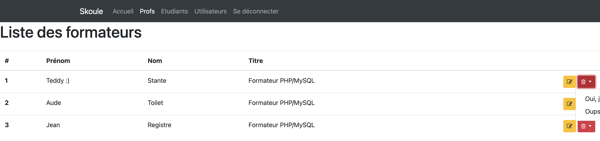
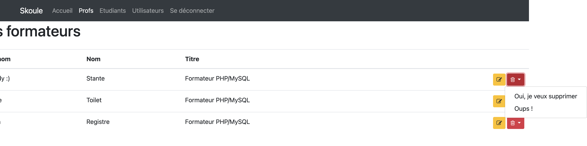

# Apprenant 2

## Des routes manquantes :

Le problème principal de cette solution vient du faut qu'une grande majorité des routes requises sont manquantes. 

De ce fait, aucun des CRUD (CREATE, READ, UPDATE, DELETE) n'est entièrement géré par la solution.

Voici une liste exhaustives des routes manquantes :
- L'ajout d'étudiant (GET et POST)
- La modification d'étudiant (GET et POST)
- La suppression d'étudiant 
- L'ajout de formateur (POST uniquement)
- La modification de formateur (GET et POST)
- La suppression de formateur 
- Le CRUD complet des utilisateurs
- La connexion utilisateur (GET et POST)
- La déconnexion 

Malheureusement, les contrôleurs associés à ces routes ne sont pas implémantés non plus. 

De ce fait, la solution est accessible à n'importe quel utilisateur sans être connecté.

En plus de ces absenses, le dossier censé contenir les vues des erreurs 403 et 404 est manquant et génère donc une erreur PHP non gérée à chaque fois que l'on cherche à atteindre une des routes manquantes.

Par ailleurs, le lien permettant la déconnexion utilisateur devrait être généré à l'aide de l'URL correspondante et de la méthode `generate()` issu de `AltoRouter` pour éviter une redirection à la racine du serveur.

Notez enfin que le bouton de modification d'un professeur pointe sur la route d'ajout (GET).

## Autres problèmes :

De base, on perd une partie du texte affiché lorsque le menu déroulant permettant la suppression d'un formateur apparaît :

Une fois le menu déroulant déployé, le défilement horizontal du site est possible :

Placer une classe Bootstrap [`container`](https://getbootstrap.com/docs/5.0/layout/containers/#default-container) englobant le contenu de chaque page dans le fichier `layout/header.tpl.php` aurait réglé le problème. Pour rappel, la classe Bootstrap `container` ajoute des marges horizontales équivalentes autour de l'élément HTML qui l'utilise.

Une mention `Deprecated` apparaît sur la page affichant la liste des étudiants. Ce problème est dû au fait que la propriété `$teacher_id` est manquante dans le modèle `Student`.

## Bonnes pratiques :

Pour éviter de surcharger vos fichiers, je vous suggère de stocker certains traitements ou tableaux dans des fichiers dédiés. Dans le cas de votre solution, cette approche serait la bienvenue pour le mappage des routes à définir dans un fichier `routes.php`, par exemple.