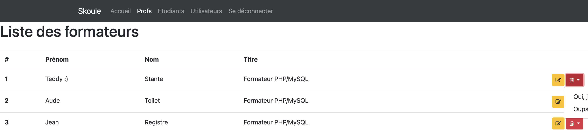
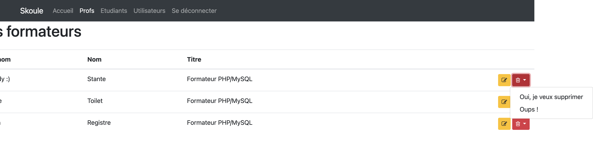

# Apprenant 3

# Problèmes avec les routes :

Par défaut, aucune route racine (`/`) n'a été définit dans le router de `AltoRouter`. Cela signifie que si l'utilisateur saisit une URL qui ne correspond à aucune des routes définies, il obtient une erreur 404.

Par ailleurs, une partie des routes requises par la solution est manquante et les contrôleurs qui sont censés leur être associés le sont aussi.

En outre, le fichier de configuration du serveur `.htaccess` doit être ajouté à la racine le dossier `public`. pour permettre de définir dynamiquement la variable d'environnement `BASE_URI` représentant la partie de l'URL qui correspond à la racine du projet. Autrement, aucune page n'est accessible en fonction de l'arborescence du serveur.

Par ailleurs, les liens permettant d'atteindre la page d'accueil devraient être générés à l'aide de l'URL correspondante et de la méthode `generate()` issu de `AltoRouter` pour éviter une redirection vers le fichier `index.html`. Même remarque pour le lien `logout` qui renvoie à la racine du projet. Souvenez-vous que l'opérateur `/` sans point devant désigne la racine de l'arborescense du serveur.

## Bonnes pratiques :

Une fois le problème résolu lié à la configuration du serveur résolu, on s'aperçoit que l'on perd la barre de navigation sur les différentes URLs (`teachers_list` et `student_list`). Pour éviter ce genre de déconvenu, je vous suggère de créer un dossier `layout` dans le répertoire `views` afin d'y stocker un fichier `header.tpl.php` contenant l'en-tête fixe de toutes les pages web ainsi que la barre de navigation et un fichier `footer.tpl.php` contenant les chemins vers les scripts JavaScript éventuels et les fermetures des balises `<body>` et `<html>`.

Pensez également à signifier au navigateur que votre solution web est écrite en français de France et s'adresse à ce public en remplaçant la valeur `en` en attribut de la balise ouvrante `<html>` par la valeur `fr-FR` pour ainsi préciser le code de la langue ainsi que le code du pays.

`MainController` est censé permettre d'afficher la page d'accueil. En l'occurence, vous vous en servez également pour définir la méthode `show()` utilisée dans les contrôleurs enfants. Je vous suggère d'ajouter plutôt un `CoreController` prenant ce rôle et laissant ainsi la responsabilité unique de l'affichage de la page d'accueil au `MainController`. Il s'agit là de respecter le principe **SOLID** *Single Responsibility*. Une classe doit avoir un seul et même rôle.

Pour éviter de surcharger vos fichiers, je vous suggère également de stocker certains traitements ou tableaux dans des fichiers dédiés. Dans le cas de votre solution, cette approche serait la bienvenue pour le mappage des routes à définir dans un fichier `routes.php`, par exemple.

### Remarques en vrac :

* Dans le fichier `TeacherController.php`, vous cherchez à modifier une variable `$newStudent` non déclarée au préalable. Par ailleurs, la méthode `studentAdd()` ne devrait pas apparaître dans `TeacherController`. Ce contrôleur devrait permettre la création d'un formateur et non d'un étudiant !

* Pour ajouter un étudiant, il ne faut pas oublier à quel professeur il est associé puisqu'il s'agit d'un champ non nul de la table `student`.

* Le style de la page 404 aurait pu être un peu plus travaillé. Son texte aurait également pu être au moins traduit.

* Le fichier `style.css` censé être chargé depuis certaines vues HTML est manquant. Par ailleurs, il est préférable de stocker les fichiers CSS, JavaScript ainsi que les médias dans un répertoire `assets` situé à la racine du dossier `public` afin d'y avoir accès depuis nos vues à l'aide de la variable super globale `$_SERVER['BASE_URI']` qui nous permet de retrouver l'URL pointant vers la racine du projet.

* Étant donné que la classe `MainController` n'a pas vocation à être instanciée et sert uniquement de moule à ses classes filles contrôleurs, il est pertinent de la définir comme étant une **classe abstraite**.

* De base, on perd une partie du texte affiché lorsque le menu déroulant permettant la suppression d'un formateur apparaît :

* Une fois le menu déroulant déployé, le défilement horizontal du site est possible :

* Placer une classe Bootstrap [`container`](https://getbootstrap.com/docs/5.0/layout/containers/#default-container) englobant le contenu de chaque page dans le fichier `layout/header.tpl.php` aurait réglé le problème. Pour rappel, la classe Bootstrap `container` ajoute des marges horizontales équivalentes autour de l'élément HTML qui l'utilise.

* Une mention `Deprecated` apparaît sur la page affichant la liste des étudiants. Ce problème est dû au fait que la propriété `$teacher_id` est manquante dans le modèle `Student`.