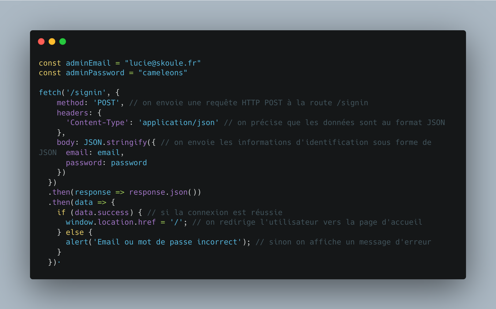
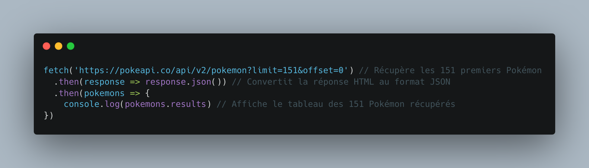

# La méthode JavaScript fetch

## Définition :

La méthode JavaScript `fetch()` permet d'interagir avec des données depuis une URL (provenant généralement d'une API) pour ainsi les utiliser ou les afficher dans une interface web.

La méthode `fetch()` est basée sur le **protocole HTTP** permettant à des applications de communiquer entre elles. En utilisant cette méthode, vous pouvez ainsi envoyer une requête HTTP `GET` (récupération), `POST` (création), `PUT` (édition) ou `DELETE` (suppression) à une URL spécifique en échanger d'une réponse renvoyer par le serveur avec lequel elle interagit.

## Exemple basique avec le verbe HTTP `POST` :

Voici un exemple de code basique utilisant la méthode `fetch()` pour connecter l'utilisateur administrateur à l'aide de votre propre route `/signin`. Supposons néanmoins que votre méthode `signinPost()` renvoie une réponse au format JSON :

Pour conclure mes explications, je vais vous inviter à prendre en main cette méthode en intéragissant non plus avec vos propres routes qui n'ont pas été pensé pour à la base étant donnée qu'elles ne renvoient pas de réponse au format JSON mais avec la [PokéAPI](https://pokeapi.co/) !

## Exemple basique avec le verbe HTTP `GET` :

Si vous connaissez un peu les Pokémon, vous devriez avoir envie de creuser le sujet !

Pour vous lancer, voici un exemple d'appel à la méthode JavaScrit `fetch()` permettant de récupérer les 151 premiers Pokémon :

Vous remarquez que cette fois, il n'est pas nécessaire de passer un second argument à la méthode `fetch()`. Par défaut, elle utilise le verbe HTTP `GET`.

En espérant vous avoir incité à creuser davantage le sujet ! N'hésitez pas à revenir vers moi en cas de difficulté ou de question supplémentaire.