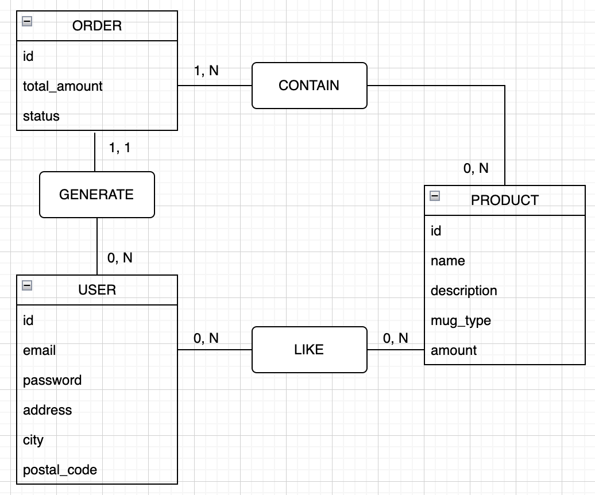

# Correction du Modèle Conceptuel de Données (MCD) :

## Entité `ADDRESS` :

Il n'y a pas vraiement d'intêret à stocker l'adresse postale dans une table dédiée dans cette conception. Étant donnée qu'aucune autre entité ne l'utilise, autant ajouter simplement les trois propriétés de l'entité `ADDRESS` (`adress`, `city`, `postal_code`) dans l'entité `USER`.

Par ailleurs, notez que comme le nom de l'entité, le nom de la propriété `address` doit prendre deux `d` et non un seul !

## Les relations :

Un utilisateur (`USER`) donné est censé pouvoir aimé (`LIKE`) entre 0 et N produits (`PRODUCT`).
À l'inverse, un produit (`PRODUCT`) donné est censé être aimé (`LIKE`) par 0 à N utilisateurs (`USER`).
Il vous faut donc remplacer les `1, 1` entre les entités `USER` et `PRODUCT` par `0, N`.

Les autres relations ne posent pas de problème.

## Autres remarques :

Il est effectivement bon de proposer une propriété `total_amount` à l'entité `ORDER`. Notez néanmoins qu'il est possible de générer automatiquement cette valeur en ajoutant tous les montants (`amount`) des produits (`PRODUCT`) contenus dans la commande (`ORDER`).

## Outils pour réaliser des MCD :

- [Draw.io](https://app.diagrams.net/) : Logiciel de dessin graphique en ligne gratuit et open source.
- [Looping](https://www.looping-mcd.fr/) : Logiciel de modélisation conceptuelle de données à télécharger gratuit et libre d'utilisation.
- [MySQL WorkBench](https://www.mysql.com/products/workbench/) : Logiciel de gestion et d'administration de bases de données MySQL à télécharger.

## Correction possible avec *Draw.io* :

Voici une correction possible appliquant les points détaillés ci-dessus et réalisée à l'aide de l'outil *Draw.io*, cité précédemment.

